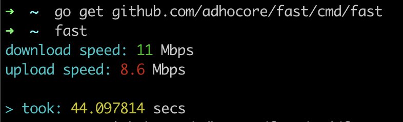

# adhocore/fast

[](https://goreportcard.com/report/github.com/adhocore/fast)
[](https://github.com/adhocore/fast/actions/workflows/lint-action.yml)
[](https://twitter.com/intent/tweet?text=Golang+tool+to+check+internet+speed+right+from+the+terminal&url=https://github.com/adhocore/fast&hashtags=golang,terminal,cli,speed-check,fast)
[](https://github.com/sponsors/adhocore)
<!-- [](https://www.paypal.me/ji10/15usd)
[](https://www.paypal.me/ji10/25usd)
[](https://www.paypal.me/ji10/50usd) -->


A GO lang command line tool to check internet speed right from the terminal.

> Uses [fast.com](https://fast.com) through headless chrome.

## Prerequistie

Chrome or Chromium or Brave browser must be installed. **`chromedp`** will try to locate the chrome executable automatically from these [paths](https://github.com/chromedp/chromedp/blob/master/allocate.go#L334-L352).

> If you get error regarding chrome availability, and you have chrome in custom path then check [Troubleshooting](#troubleshooting).

## Usage

Install `fast` binary:
```sh
go get -u github.com/adhocore/fast/cmd/fast
```
> or in recent go versions:
```
go install github.com/adhocore/fast/cmd/fast@v1.2.0
```

Finally, make sure `$GOPATH` or `$HOME/go/bin` is in your `$PATH` or `%path%`, then run:
```sh
fast

# if you just want download speed (pass -noup aka no upload speed)
fast -noup
```

Wait a while or `Ctrl+C` if you can't. That's all.

### Integration

You can also integrate `fast` in your Go projects.

```go
import (
    "github.com/adhocore/chin"
    "github.com/adhocore/fast"
)

// true if you want only download speed
noUpload := false

// Optional, shows a spinner while waiting result,
spin := chin.New()
go spin.Start()

// Prints the output right away:
fast.Run(noUpload)

// OR, to customize print style:
res, err := fast.Measure(noUpload)
// Then use res (`fast.Fast` struct) to print in custom style.

// Stop the spinner finally!
spin.Stop()
```

## Screen



## Troubleshooting

In **MacOS**, you can do something like this:

```sh
echo '#!/bin/sh\n\n/Applications/Google\ Chrome.app/Contents/MacOS/Google\ Chrome $@' > /usr/local/bin/chrome

chmod +x /usr/local/bin/chrome
```

In **WSL**, you can symlink chrome from host WinOS like this:
```sh
sudo ln -s /mnt/c/Program\ Files/Google/Chrome/Application/chrome.exe /usr/local/bin/chrome
```

In other OS, you can do something equivalent to above. The idea is `chrome` command should point to **Chrome Browser**.

---
### Other projects
My other golang projects you might find interesting and useful:

- [**gronx**](https://github.com/adhocore/gronx) - Lightweight, fast and dependency-free Cron expression parser (due checker), task scheduler and/or daemon for Golang (tested on v1.13 and above) and standalone usage.
- [**urlsh**](https://github.com/adhocore/urlsh) - URL shortener and bookmarker service with UI, API, Cache, Hits Counter and forwarder using postgres and redis in backend, bulma in frontend; has [web](https://urlssh.xyz) and cli client
- [**goic**](https://github.com/adhocore/goic) - Go Open ID Connect, is OpenID connect client library for Golang, supports the Authorization Code Flow of OpenID Connect specification.
- [**chin**](https://github.com/adhocore/chin) - A GO lang command line tool to show a spinner as user waits for some long running jobs to finish.
